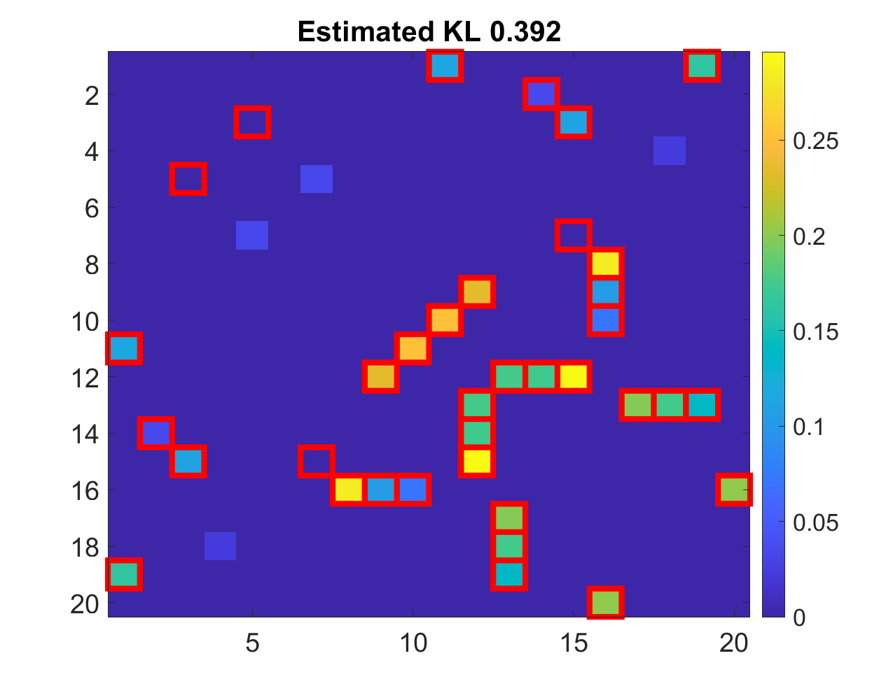

# Trimmed-Density-Ratio-Estimation

Code for https://arxiv.org/pdf/1703.03216.pdf

This code reproduces the experiments in Section 6.1.

Run ```demo_GM``` in MATLAB, you should be able to see the following plot.

